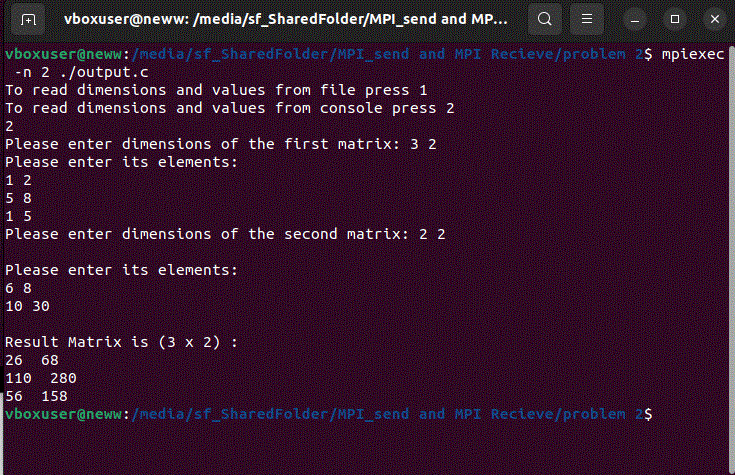

# Matrix-Multiplication_ParallelProccessing

# Overview:

Write a matrix multiplication program. Matrices’ dimensions and values are taken as
an input. Multiply the two matrices together then print the result. You need to 
implement this program in two modes. 
First mode reads the input from the console, and the second one reads the input 
from a file.

# Requiremnts:

* you are required to use message passing interface "MPI" to distribute the inputs rows for the allocated (X) processes
  in order to multiply the two input matrices and send the result back to the master.
  
you can excute and allocate the processes (cores) in this way:

example  :
```
mpiexec -n (X) ./output.c

```
* handle the case of non sufficient procsses for the matrices' rows 

* Read the number of rows and columns of the input matrices. They are written in the first line of the file as ”row=x col=y”. The following is an example of the format on an input file.  

example :
  ```
  row=3 col=5
  1 2 3 4 5
  6 7 8 9 10
  11 12 13 14 15

  ```

# How to run and compile MPI programm : 
* you need to download MPI beforehand
* Open the terminal in your linux and do the following 


compilation command:
  ```
 mpicc your_source_code.c -o your_output_file.c

  ```

excution command :
 ```
 mpiexec -n (X) ./your_output_file.c

 ```
* ignore the error from MPI library when you open your IDE  just run directly from the terminal.

# Test Case example : 

